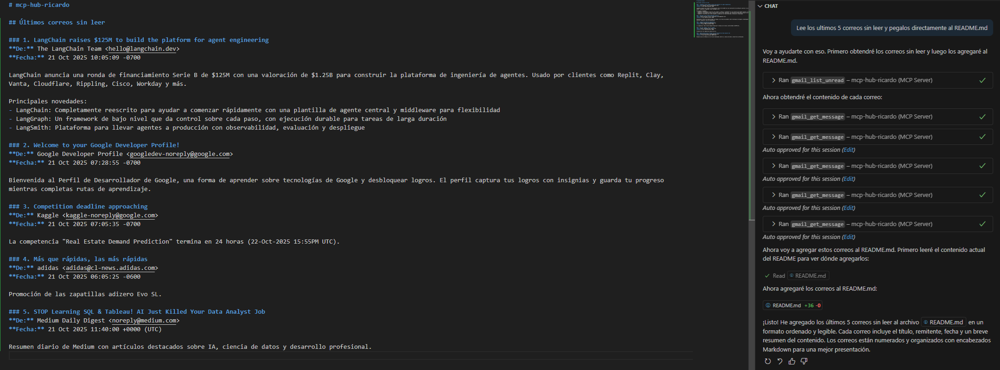
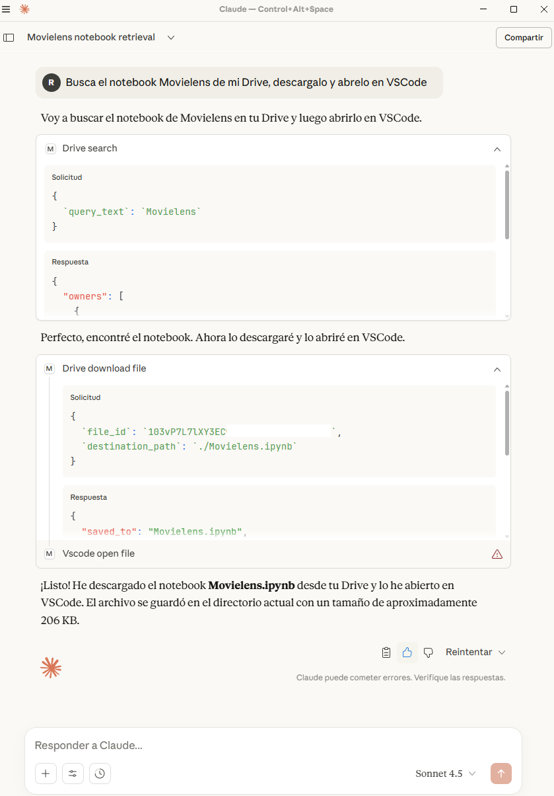
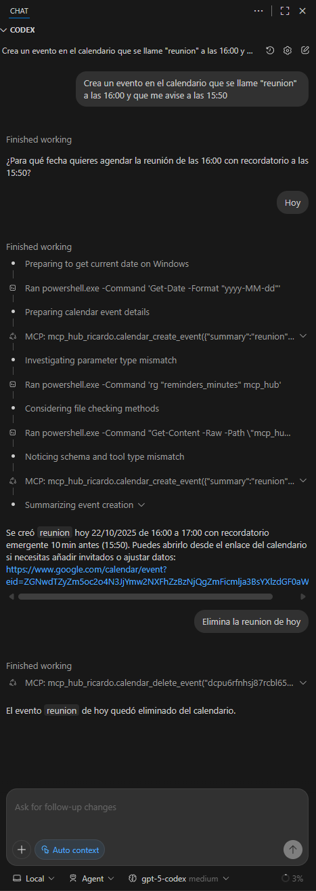
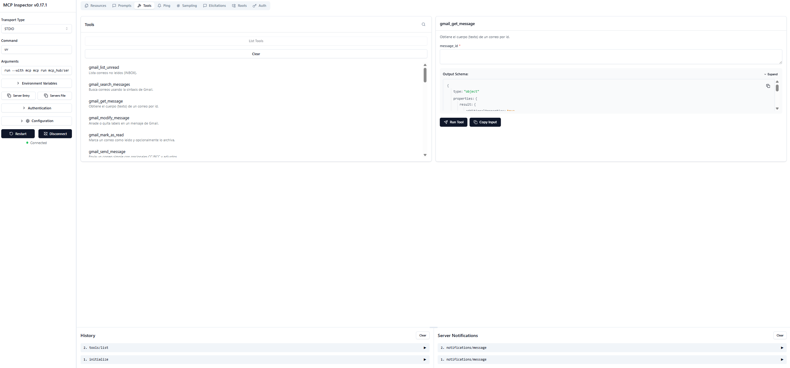

<p align="right">
  <a href="https://github.com/Ricardouchub/mcp-hub-ricardo/blob/master/README-english.md">
    README English
  </a>
</p>

# MCP Hub Personal


**MCP Server personal** para integrar herramientas de uso cotidiano (Gmail, Google Calendar, Drive, VSCode y GitHub) con clientes compatibles como **VSCode Copilot**, **Codex** y **Claude for Desktop**.

---

## Descripcion

Este proyecto implementa un **MCP Server multiproposito** que actua como hub local para interactuar con los siguientes servicios:

- Gmail: listar correos, leer contenido, enviar mensajes, gestionar labels y adjuntar archivos.
- Google Calendar: listar eventos, crear/editar/eliminar reuniones y exportarlas a `.ics`.
- Google Drive: buscar, crear, actualizar, descargar, eliminar y compartir archivos.
- VSCode Local: abrir archivos/carpetas, gestionar extensiones, buscar texto y ejecutar comandos o git desde la CLI de VSCode.
- GitHub: listar repos, crear issues, administrar pull requests, ramas, commits y releases.

Todo el servidor esta construido con el framework **FastMCP**, sin depender de Docker ni de servicios externos adicionales.

---

## Lista de Tools

| Servicio | Tools | API/CLI |
|----------|-------|---------|
| Gmail | `gmail_list_unread`, `gmail_search_messages`, `gmail_get_message`, `gmail_modify_message`, `gmail_mark_as_read`, `gmail_send_message` | Gmail API v1 | `gmail.readonly`, `gmail.modify`, `gmail.send` |
| Calendar | `calendar_upcoming`, `calendar_create_event`, `calendar_update_event`, `calendar_delete_event`, `calendar_export_event` | Calendar API v3 | `calendar` |
| Drive | `drive_search`, `drive_create_file`, `drive_update_file`, `drive_download_file`, `drive_delete_file`, `drive_share_file` | Drive API v3 | `drive`, `drive.metadata.readonly` |
| GitHub | `github_list_repos`, `github_create_issue`, `github_list_pull_requests`, `github_create_pull_request`, `github_merge_pull_request`, `github_create_branch`, `github_commit_file`, `github_list_releases`, `github_create_release` | PyGithub | `repo` |
| VSCode | `vscode_open`, `vscode_open_file`, `vscode_install_ext`, `vscode_list_extensions`, `vscode_search_text`, `vscode_run_command`, `vscode_git_status` | VSCode CLI (`code`) | Local CLI |

---

## Arquitectura

```
mcp-hub-ricardo/
├── mcp_hub/
│   ├── auth/
│   │   └── google_auth.py          # Manejo de OAuth2 para las APIs de Google
│   ├── tools/
│   │   ├── calendar_tool.py        # Endpoints de Calendar
│   │   ├── drive_tool.py           # Endpoints de Drive
│   │   ├── gmail_tool.py           # Endpoints de Gmail
│   │   ├── github_tool.py          # Integracion con la API de GitHub
│   │   └── vscode_tool.py          # Acciones locales sobre VSCode
│   ├── core/
│   │   └── mcp.py                  # Instancia central de FastMCP
│   └── server.py                   # Punto de entrada del servidor MCP
├── secrets/
│   └── credentials.google.json     # Credenciales OAuth2 (crear manualmente)
├── data/
│   └── token.google.json           # Token generado tras la autenticacion inicial
├── pyproject.toml
└── .env.example
```

---

## Requisitos

- Python **3.10+**
- Node.js **18+** (solo para el Inspector MCP opcional)
- Cuenta de Google Cloud con credenciales OAuth2
- Token personal de GitHub con scope `repo`
- Visual Studio Code con **Copilot / Codex** instalados

---

## Instalacion

```bash
git clone https://github.com/Ricardouchub/mcp-hub-ricardo.git
cd mcp-hub-ricardo
uv sync
uv pip install -e .
```

---

## Autenticacion con Google

1. Crea credenciales OAuth2 desde Google Cloud Console.
2. Descarga el archivo `credentials.json`.
3. Guardalo como `secrets/credentials.google.json`.
4. Ejecuta una tool por primera vez (por ejemplo `calendar_upcoming`) para iniciar el flujo de autorizacion.
5. Al finalizar, se guardara un token persistente en `data/token.google.json` (si cambias scopes, borra este archivo y repite el flujo).

---

## Ejecucion local

```
uv run mcp dev mcp_hub/server.py
```

Esto abre el **Inspector MCP** para probar herramientas y validar respuestas.

Modo produccion (STDIO):

```
uv run mcp run stdio mcp_hub/server.py
```

---

## Integración a clientes


### 1) Codex

Codex lee la configuración MCP desde `~/.codex/config.toml` 

#### `~/.codex/config.toml`
```toml
[mcp_servers.mcp_hub_ricardo]
# Ajusta el ejecutable según tu OS
# Windows:
command = "PROJECT_ROOT/.venv/Scripts/mcp.exe"
# macOS/Linux:
# command = "PROJECT_ROOT/.venv/bin/mcp"

args = ["run", "--transport", "stdio", "PROJECT_ROOT/mcp_hub/server.py"]
cwd  = "PROJECT_ROOT"

[mcp_servers.mcp_hub_ricardo.env]
GOOGLE_CREDENTIALS_PATH = "PROJECT_ROOT/secrets/credentials.google.json"
GOOGLE_TOKEN_PATH       = "PROJECT_ROOT/data/token.google.json"
GOOGLE_SCOPES           = "https://www.googleapis.com/auth/gmail.readonly https://www.googleapis.com/auth/gmail.modify https://www.googleapis.com/auth/gmail.send https://www.googleapis.com/auth/calendar https://www.googleapis.com/auth/drive https://www.googleapis.com/auth/drive.metadata.readonly"
GITHUB_TOKEN            = "YOUR_GITHUB_TOKEN"
```


### 2) Claude Desktop

Claude Desktop usa `%APPDATA%/Claude/claude_desktop_config.json` (Windows) o `~/Library/Application Support/Claude/claude_desktop_config.json` (macOS). Tras editar, **reinicia** Claude Desktop.

#### `claude_desktop_config.json`
```json
{
  "mcpServers": {
    "mcp-hub-ricardo": {
      "command": "PROJECT_ROOT/.venv/Scripts/mcp.exe",
      "args": [
        "run",
        "--transport",
        "stdio",
        "PROJECT_ROOT/mcp_hub/server.py"
      ],
      "cwd": "PROJECT_ROOT",
      "env": {
        "GOOGLE_CREDENTIALS_PATH": "PROJECT_ROOT/secrets/credentials.google.json",
        "GOOGLE_TOKEN_PATH": "PROJECT_ROOT/data/token.google.json",
        "GOOGLE_SCOPES": "https://www.googleapis.com/auth/gmail.readonly https://www.googleapis.com/auth/gmail.modify https://www.googleapis.com/auth/gmail.send https://www.googleapis.com/auth/calendar https://www.googleapis.com/auth/drive https://www.googleapis.com/auth/drive.metadata.readonly",
        "GITHUB_TOKEN": "YOUR_GITHUB_TOKEN"
      }
    }
  }
}
```

### 3) VS Code + Copilot

Abre el Command Palette y ejecuta: **MCP: Open User Configuration**

#### `mcp.json`

```json
{
  "servers": {
    "mcp-hub-ricardo": {
      "type": "stdio",
      "command": "PROJECT_ROOT/.venv/Scripts/mcp.exe",
      "args": ["run", "--transport", "stdio", "PROJECT_ROOT/mcp_hub/server.py"],
      "cwd": "PROJECT_ROOT",
      "env": {
        "GOOGLE_CREDENTIALS_PATH": "PROJECT_ROOT/secrets/credentials.google.json",
        "GOOGLE_TOKEN_PATH": "PROJECT_ROOT/data/token.google.json",
        "GOOGLE_SCOPES": "https://www.googleapis.com/auth/gmail.readonly https://www.googleapis.com/auth/gmail.modify https://www.googleapis.com/auth/gmail.send https://www.googleapis.com/auth/calendar https://www.googleapis.com/auth/drive https://www.googleapis.com/auth/drive.metadata.readonly",
        "GITHUB_TOKEN": "YOUR_GITHUB_TOKEN"
      }
    }
  }
}
```

**Pasos en VS Code**:
1. Asegúrate de tener VS Code actualizado y acceso a Copilot.  
2. **Copilot Chat**, haz clic en la herramienta de **selección de tools** y habilita las herramientas del servidor **mcp-hub-ricardo**. 


---

## Stack

- Python 3.10+ con [uv](https://github.com/astral-sh/uv) para gestion de entorno y ejecucion.
- [FastMCP](https://github.com/modelcontextprotocol/servers) como framework MCP.
- Google API Client (`google-api-python-client`, `google-auth-oauthlib`) para Gmail/Calendar/Drive.
- [PyGithub](https://pygithub.readthedocs.io/) para interacciones con GitHub.

---


## Ejemplo de uso 

### Copilot (VSCode)


### Claude (desktop)
 

### Codex (VSCode)


## MCP Inspector



---

## Autor

**Ricardo Urdaneta**

[LinkedIn](https://www.linkedin.com/in/ricardourdanetacastro/) | [GitHub](https://github.com/Ricardouchub)
